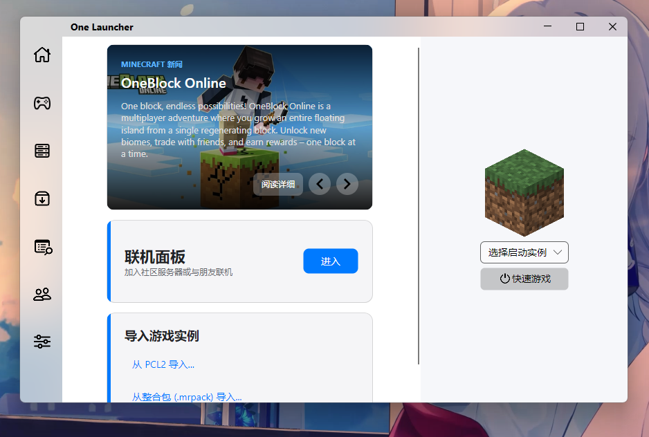
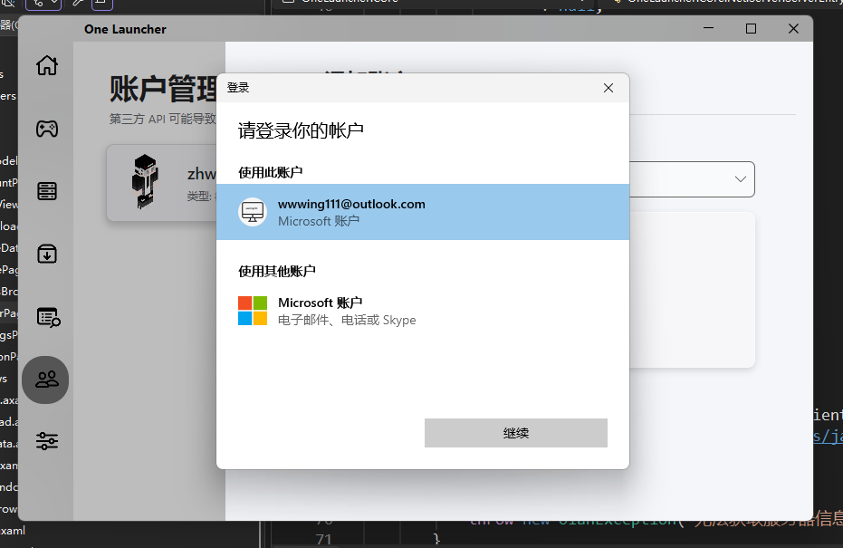
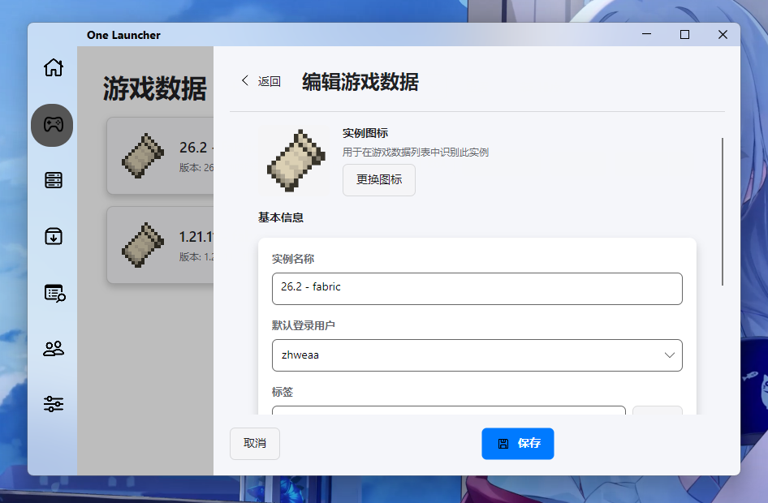
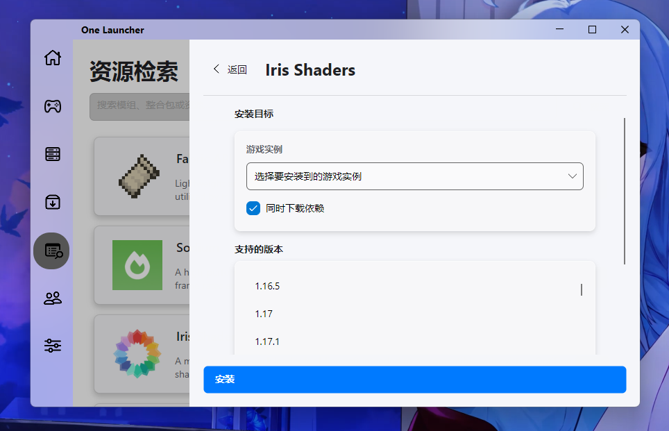
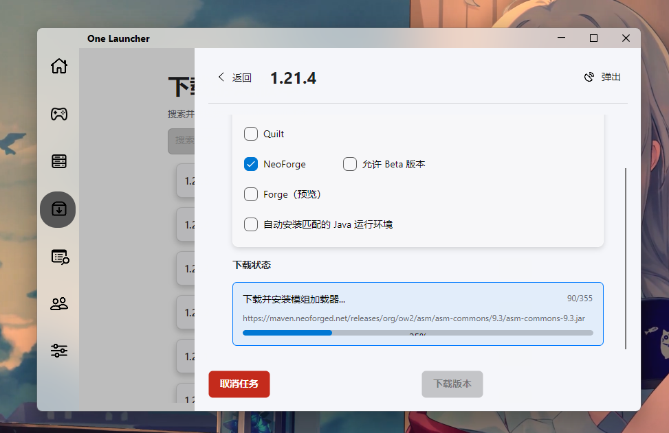

# OneLauncher

轻量、快速、少配置的 Minecraft 启动器。

## Windows 一键安装

在 Windows PowerShell 中运行：

```powershell
Invoke-Expression ((New-Object System.Net.WebClient).DownloadString('https://raw.githubusercontent.com/zhweaa/OneLauncher/master/OneLauncher.Desktop/install.ps1'))
```

安装脚本可选择仅下载启动器，或同时安装 .NET 10 Desktop Runtime 与 Java 21。

## 使用

1. 在“版本管理”选择 Minecraft 版本、模组加载器和 Java，点击下载。
2. 在“游戏数据”调整实例、账户和启动参数。
3. 回到首页选择实例，点击“快速游戏”。

## 核心功能

- **Microsoft 正版登录**：Windows 直接调用系统 Web Account Manager（WAM）完成 Microsoft 账户授权，无需打开浏览器、无需输入验证码；随后自动完成 Xbox Live、Minecraft Services 和正版权益验证。
- **版本与实例**：Mojang、BMCL、OneLauncher 多源竞速下载，支持 SHA-1 校验、PCL2 版本导入和 `.mrpack` 整合包导入。
- **模组与资源**：支持 Fabric、Quilt、NeoForge，Forge 为预览支持；通过 Modrinth 检索并安装模组、资源包和光影。
- **Java 管理**：按 Minecraft 版本自动下载匹配的 Java，支持多版本运行时。
- **账户与服务器**：支持 Microsoft、Yggdrasil 外置和离线账户；收藏服务器并关联游戏实例。
- **Windows 联机**：与 [MinecraftConnectTool（MCT）](https://github.com/MCZLF/MinecraftConnectTool) 合作提供 P2P 联机能力。
- **跨平台桌面**：基于 Avalonia，支持 Windows、Linux 和 macOS；MCT 联机及 WAM 登录为 Windows 专属能力。

## 界面











> 项目仍在持续开发中。界面、下载源和联机服务可能随版本更新而变化。

## 开发

### 环境要求

- [.NET 10 SDK](https://dotnet.microsoft.com/download/dotnet/10.0)
- Visual Studio 2022、Rider 或其他支持 .NET 10 的 IDE
- Java 可由启动器自动安装，也可自行准备

### 构建和运行

```powershell
git clone https://github.com/zhweaa/OneLauncher.git
cd OneLauncher
dotnet restore OneLauncher.sln
dotnet run --project OneLauncher.Desktop
```

发布 Windows x64：

```powershell
dotnet publish OneLauncher.Desktop -c Release -r win-x64 --self-contained false
```

### 命令行入口

```text
--quicklyPlay <instance-id>       快速启动实例
--joinServer <server-id-or-name>  启动收藏服务器
--releaseMemory                   释放游戏进程内存
```

## 项目结构

```text
OneLauncher/          # Avalonia UI
OneLauncher.Core/     # 下载、启动、实例和模组管理
OneLauncher.Core.Net/ # 账户、Java、Modrinth、服务器和 MCT
OneLauncher.Desktop/  # 桌面入口
OneLauncher.Console/  # 命令行入口
```

UI 规范见 [`docs/UI_FI.md`](docs/UI_FI.md)，架构说明见 [`Welcome.md`](Welcome.md)。

## 开源与致谢

本项目使用 [Apache License 2.0](https://www.apache.org/licenses/LICENSE-2.0) 开源，使用或参考 [Avalonia](https://github.com/AvaloniaUI/Avalonia)、[CommunityToolkit.Mvvm](https://github.com/CommunityToolkit/dotnet)、[AsyncImageLoader.Avalonia](https://github.com/AvaloniaUtils/AsyncImageLoader.Avalonia)、[ProjBobcat](https://github.com/Corona-Studio/ProjBobcat/)、[Modrinth](https://modrinth.com/) 和 [MinecraftConnectTool](https://github.com/MCZLF/MinecraftConnectTool)。

OneLauncher 与 Mojang、Microsoft 或 Minecraft 官方没有从属关系。更多法律信息见 [`Terms_of_Service.md`](Terms_of_Service.md) 和 [`Privacy_Policy.md`](Privacy_Policy.md)。

欢迎联系作者讨论问题或提交 Issue：QQ `1826379500`。
